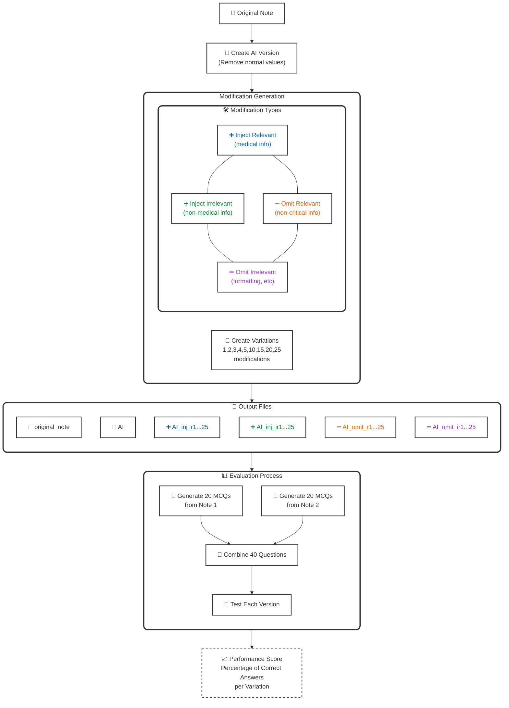

```mermaid
flowchart TD
    Input["📄 Original Note"] --> AI["🤖 Create AI Version<br/>(Remove normal values)"]
    AI --> ModSection

    subgraph ModSection["Modification Generation"]
        subgraph Modifications["🛠️ Modification Types"]
            inj_r["➕ Inject Relevant<br>(medical info)"]:::blue --- inj_ir["➕ Inject Irrelevant<br>(non-medical info)"]:::green
            inj_r --- omit_r["➖ Omit Relevant<br>(non-critical info)"]:::orange
            inj_ir --- omit_ir["➖ Omit Irrelevant<br>(formatting, etc)"]:::purple
            omit_r --- omit_ir
        end
        
        Variations["🔢 Create Variations<br>1,2,3,4,5,10,15,20,25<br>modifications"]:::white
    end
    
    ModSection --> Output
    
    subgraph Output["💾 Output Files"]
        direction TB
        orig["📄 original_note"]:::white
        ai["🤖 AI"]:::white
        inj_r_files["➕ AI_inj_r1...25"]:::blue
        inj_ir_files["➕ AI_inj_ir1...25"]:::green
        omit_r_files["➖ AI_omit_r1...25"]:::orange
        omit_ir_files["➖ AI_omit_ir1...25"]:::purple
    end
    
    Output --> Eval

    subgraph Eval["📊 Evaluation Process"]
        direction TB
        MCQ1["📝 Generate 20 MCQs<br>from Note 1"]:::yellow
        MCQ2["📝 Generate 20 MCQs<br>from Note 2"]:::yellow
        Combine["🔄 Combine 40 Questions"]:::yellow
        Test["🎯 Test Each Version"]:::yellow
        
        MCQ1 --> Combine
        MCQ2 --> Combine
        Combine --> Test
    end
    
    Eval --> Score["📈 Performance Score<br>Percentage of Correct Answers<br>per Variation"]:::score

    classDef default fill:#ffffff,stroke:#333,stroke-width:2px
    classDef blue fill:#ffffff,stroke:#333,stroke-width:2px,color:#0066cc
    classDef green fill:#ffffff,stroke:#333,stroke-width:2px,color:#009933
    classDef orange fill:#ffffff,stroke:#333,stroke-width:2px,color:#ff6600
    classDef purple fill:#ffffff,stroke:#333,stroke-width:2px,color:#9933cc
    classDef yellow fill:#ffffff,stroke:#333,stroke-width:2px,color:#333333
    classDef white fill:#ffffff,stroke:#333,stroke-width:2px
    classDef score fill:#ffffff,stroke:#333,stroke-width:2px,stroke-dasharray: 5 5

    style ModSection fill:#ffffff,stroke:#333,stroke-width:3px,rx:10px
    style Modifications fill:#ffffff,stroke:#333,stroke-width:3px,rx:10px
    style Eval fill:#ffffff,stroke:#333,stroke-width:3px,rx:10px
    style Output fill:#ffffff,stroke:#333,stroke-width:3px,rx:10px

```
